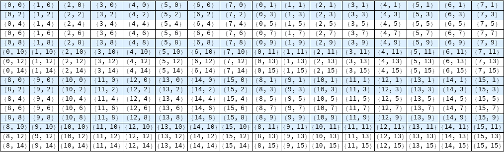
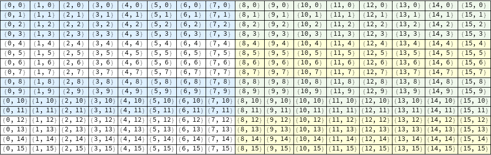
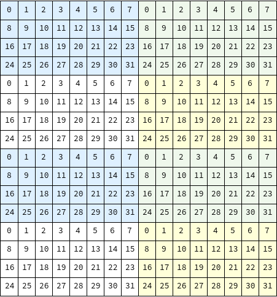
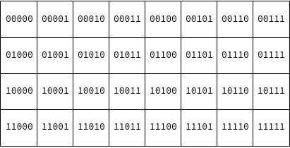

# Mipmap

Vulkan mipmap generation with 3 strategies: blit chain, compute with per-level barriers, compute with subgroup shuffle.


## Usage Guide

> [!TIP]
> This project uses GitHub Action to ensure you can build and properly generate the results, tested in macOS and Ubuntu with Clang.
> If you are struggling with the build, refer to the [workflow file](.github/workflows/deploy-and-test.yml) to see how it works.

It reads the power-of-2 dimension image, generate full mipmaps by three strategies, and persist the results into output directory. You can compare the execution times using GPU timestamp query. All core codes are in `main.cpp` and shader codes are in `shaders` directory. Each `subgruop_mipmap_<subgroup-size>.comp` shader filenames are corresponding to the available subgroup size, and application will choose the proper shader file based on the system subgroup size.

### Build

For compilation, you need:
- C++23 with Standard Library Module (a.k.a. [`import std;`](https://wg21.link/P2465R3))
- CMake ≥ 3.28
- External dependencies:
  - [glslc](https://github.com/google/shaderc/tree/main/glslc): included in Vulkan SDK.
  - [Vulkan Memory Allocator](https://github.com/GPUOpen-LibrariesAndSDKs/VulkanMemoryAllocator) and its [C++ binding](https://github.com/stripe2933/VulkanMemoryAllocator-Hpp) (originally from [Yaaz](https://github.com/YaaZ/VulkanMemoryAllocator-Hpp))
  - [stb_image](https://github.com/nothings/stb/blob/master/stb_image.h)

```bash
mkdir build
cmake -S . -B build -G Ninja                                          \
  -DCMAKE_BUILD_TYPE=Release                                          \
  -DLIBCXX_BUILD=${{ github.workspace }}/llvm-project/build           \
  -DCMAKE_TOOLCHAIN_FILE=$VCPKG_ROOT/scripts/buildsystems/vcpkg.cmake # Or other package manager what you use
cmake --build build -t mipmap --config Release
```

### Run

For execution, your Vulkan driver must support:
- Vulkan 1.2
- Must support graphics queue.
- Timestamp query: `timestampPeriod` > 0 and `timestampComputeAndGraphics`.
- Subgroup: subgroup size must be at least 8 and must support shuffle operation.
- Device features:
  - `hostQueryReset` (`VK_EXT_host_query_reset`)
  - `storageImageUpdateAfterBind` (`VK_EXT_descriptor_indexing`)
  - `runtimeDescriptorArray` (`VK_EXT_descriptor_indexing`)

If all requirements are satisfied, you can run the executable as:

```bash
./mipmap <image-path> <output-dir>
```

The input image dimension must be power of 2, and its size must be at least `32x32`.

In output directory, three files (`blit.png`, `compute_per_level_barriers.png`, `compute_subgroup.png`) will be generated. Each file corresponds to their generation method, respectively.

## How does it work?

### Blit chain

Already explained in [vulkan-tutorial](https://vulkan-tutorial.com/Generating_Mipmaps). It blits from level `n-1` to `n`
with image layout transition for every level.

`main.cpp`
```c++
for (auto [srcLevel, dstLevel] : std::views::iota(0U, image.mipLevels) | std::views::pairwise) {
    if (srcLevel != 0U){
        const std::array barriers {
            vk::ImageMemoryBarrier {
                vk::AccessFlagBits::eTransferWrite, vk::AccessFlagBits::eTransferRead,
                vk::ImageLayout::eTransferDstOptimal, vk::ImageLayout::eTransferSrcOptimal,
                {}, {},
                image,
                { vk::ImageAspectFlagBits::eColor, srcLevel, 1, 0, 1 }
            },
            vk::ImageMemoryBarrier {
                {}, vk::AccessFlagBits::eTransferWrite,
                {}, vk::ImageLayout::eTransferDstOptimal,
                {}, {},
                image,
                { vk::ImageAspectFlagBits::eColor, dstLevel, 1, 0, 1 }
            },
        };
        commandBuffer.pipelineBarrier(
            vk::PipelineStageFlagBits::eTransfer, vk::PipelineStageFlagBits::eTransfer,
            {}, {}, {}, barriers);
    }

    commandBuffer.blitImage(
        image, vk::ImageLayout::eTransferSrcOptimal,
        image, vk::ImageLayout::eTransferDstOptimal,
        vk::ImageBlit {
            { vk::ImageAspectFlagBits::eColor, srcLevel, 0, 1 },
            { vk::Offset3D{}, vk::Offset3D { vku::convertOffset2D(image.mipExtent(srcLevel)), 1 } },
            { vk::ImageAspectFlagBits::eColor, dstLevel, 0, 1 },
            { vk::Offset3D{}, vk::Offset3D { vku::convertOffset2D(image.mipExtent(dstLevel)), 1 } },
        },
        vk::Filter::eLinear);
}
```

| Pros ✅ | Cons ❌                                                                              |
|--------|-------------------------------------------------------------------------------------|
| Simple to implement | - Requires multiple image layout transitions<br/>- Requires graphics capable queue (not a serious problem, but could be ridiculous if you deal with compute specialized queue families) |

### Compute with per-level barriers

It uses `16x16` workgroup size, and each invocation fetches 4 texels from the source image.

`mipmap.comp`
```glsl
void main(){
    vec4 averageColor
        = imageLoad(mipImages[srcLevel], 2 * ivec2(gl_GlobalInvocationID.xy))
        + imageLoad(mipImages[srcLevel], 2 * ivec2(gl_GlobalInvocationID.xy) + ivec2(1, 0))
        + imageLoad(mipImages[srcLevel], 2 * ivec2(gl_GlobalInvocationID.xy) + ivec2(0, 1))
        + imageLoad(mipImages[srcLevel], 2 * ivec2(gl_GlobalInvocationID.xy) + ivec2(1, 1));
    averageColor /= 4.0;
    imageStore(mipImages[dstLevel], ivec2(gl_GlobalInvocationID.xy), averageColor);
}
```

`main.cpp`
```c++
commandBuffer.bindPipeline(vk::PipelineBindPoint::eCompute, *pipeline);
commandBuffer.bindDescriptorSets(vk::PipelineBindPoint::eCompute, *pipelineLayout, 0, descriptorSets, {});
for (auto [srcLevel, dstLevel] : std::views::iota(0U, mipLevels) | std::views::pairwise) {
    if (srcLevel != 0U) {
        constexpr vk::MemoryBarrier barrier {
            vk::AccessFlagBits::eShaderWrite, vk::AccessFlagBits::eShaderRead,
        };
        commandBuffer.pipelineBarrier(
            vk::PipelineStageFlagBits::eComputeShader, vk::PipelineStageFlagBits::eComputeShader,
            {}, barrier, {}, {});
    }

    commandBuffer.pushConstants<PushConstant>(*pipelineLayout, vk::ShaderStageFlagBits::eCompute, 0, PushConstant { srcLevel });
    commandBuffer.dispatch(
        divCeil(baseImageExtent.width >> dstLevel, 16U),
        divCeil(baseImageExtent.height >> dstLevel, 16U),
        1);
}
```

This method has some advantages and disadvantages compared to the blit chain:

| Pros ✅                                                           | Cons ❌                                                                                                                                                                                                                                                                |
|------------------------------------------------------------------|-----------------------------------------------------------------------------------------------------------------------------------------------------------------------------------------------------------------------------------------------------------------------|
| - Compute only<br/>- No image layout transition between dispatch | - Still requires memory barrier between dispatch<br/>- Managing pipeline and descriptor sets is hard<br/>- Slower than blit chain (because it must compile the shader and bind the pipeline and descriptors)<br/>- Cannot be used for non-power of 2 dimension images |

### Compute with subgroup shuffle

This is the main concept, so I'll explain it in detail.

#### What is subgroup?

In shader, invocations within a specific group can communicate without an explicit synchronization, which is called ***subgroup***. Size of subgroups are differ in system, but every NVIDIA GPUs are 32 and typical AMD GPUs are 64.

**If a subgroup holds a 2x2 texel data, it can average them into 1 texel without explicit synchronization**. This can be extended to `2^n x 2^n` texel data, and it can be mipmapped into 1 texel (if subgroup size is enough).

#### Mapping from invocation ID to texel fetch position

Let's assume that the workgroup size is `16x16`, and subgroup size is `32`. Then, total `256 / 32 = 8` subgroups are laid linearly in the workgroup.


Each `16x2` subgroup is filled with alternating background color for distinction. Numbers in each cell are `gl_SubgroupInvocationID`.

It would be suboptimal if an invocation within a subgroup fetches the texel at `gl_GlobalInvocationID.xy` like before, because they can only average `2x2` texels. For example, in the first subgroup in the above figure (filled with light blue), ID with 0, 1, 16 and 17 can communicate and make `2x2` region into 1 average pixel, however it can't make `4x4` region into 1 because the row count of a subgroup is 2. To maximize the efficiency, **texel fetching shape inside a subgroup have to be as square as possible**.



In the above figure, optimal texel fetching position for each invocation is shown. With this mapping, the subgroups can make `4x4` region into 1 average pixel.



If we plot the `gl_LocalInvocationID.xy` with their own texel fetching positions, the figure would be like above. Each subgroup filled with distinct colors. In this case, the subgroup extent is `8x4`, which is more square-shaped than before.



Now, each subgroup can average two `4x4` regions (`0..3, 8..11, 16..19, 24..27` and `4..7, 12..15, 20..23, 28..31`) to 1 pixel.

We need a mapping between texel fetch location and `gl_LocalInvocationID`. It would be

```glslc
ivec2 sampleLocation = gl_WorkGroupSize.xy * gl_WorkGroupID.xy + ivec2(
    gl_LocalInvocationID.x % 8 + (gl_LocalInvocationID.y / 8) * 8,
    ((gl_LocalInvocationID.y / 2) * 2 + gl_LocalInvocationID.x / 8) % 16
);
```

Or more bit manipulation friendly version:

```glslc
ivec2 samplePosition = gl_WorkgroupSize.xy * gl_WorkGroupID.xy + ivec2(
    (gl_LocalInvocationID.x & 7U) | (gl_LocalInvocationID.y & ~7U),
    ((gl_LocalInvocationID.y << 1U) | (gl_LocalInvocationID.x >> 3U)) & 15U
);
```

#### Subgroup shuffle

With properly mapped texels in the subgroup, we can use ***Subgroup shuffle*** to average the invocation quads.



Above figure is visualization of `gl_SubgroupInvocationID` with binary form in a subgroup. With [`subgroupShuffleXor`](https://www.khronos.org/blog/vulkan-subgroup-tutorial), an invocation (let's say its `gl_SubgroupInvocationID` as `i`) can access to the invocation's data, whose `gl_SubgroupInvocationID` is `i ^ <constant-value>`, i.e. bitwise XOR.

For example, the following shader for the invocations whose `gl_SubgroupID`s are `0, 1, 8, 9` will be executed as:

```glsl
vec4 averageColor = imageLoad(baseImage, samplePosition);

// | gl_SubgroupInvocationID |  gl_LocalInvocationID.xy  |   averageColor    |
// |-------------------------|---------------------------|-------------------|
// |       0(=0b00000)       |           (0, 0)          |  baseImage[0, 0]  |--┐
// |-------------------------|---------------------------|-------------------|  |
// |       1(=0b00001)       |           (1, 0)          |  baseImage[1, 0]  |--|--┐
// |-------------------------|---------------------------|-------------------|  |  |
// |       8(=0b01000)       |           (0, 1)          |  baseImage[0, 1]  |--|--|--┐
// |-------------------------|---------------------------|-------------------|  |  |  |
// |       9(=0b01001)       |           (1, 1)          |  baseImage[1, 1]  |--|--|--|--┐
                                                                            //  |  |  |  |
averageColor += subgroupShuffleXor(averageColor, 1);                        //  |  |  |  |
                                                                            //  |  |  |  |
// | gl_SubgroupInvocationID | gl_SubgroupInvocationID^1 |   averageColor    |  |  |  |  |
// |-------------------------|---------------------------|-------------------|  |  |  |  |
// |       0(=0b00000)       |         1(=0b00001)       | baseImage[0, 0]   |  |  |  |  |
// |                         |                           | + baseImage[1, 0] |<-|--┘  |  |  --┐
// |-------------------------|---------------------------|-------------------|  |     |  |    |
// |       1(=0b00001)       |         0(=0b00000)       | baseImage[1, 0]   |  |     |  |    |
// |                         |                           | + baseImage[0, 0] |<-┘     |  |  --|--┐
// |-------------------------|---------------------------|-------------------|        |  |    |  |
// |       8(=0b01000)       |         9(=0b01001)       | baseImage[0, 1]   |        |  |    |  |
// |                         |                           | + baseImage[1, 1] |<-------|--┘  --|--|--┐
// |-------------------------|---------------------------|-------------------|        |       |  |  |
// |       9(=0b01001)       |         8(=0b01000)       | baseImage[1, 1]   |        |       |  |  |
// |                         |                           | + baseImage[0, 1] |<-------┘     --|--|--|--┐
                                                                            //                |  |  |  |
averageColor += subgroupShuffleXor(averageColor, 8);                        //                |  |  |  |
                                                                            //                |  |  |  |
// | gl_SubgroupInvocationID | gl_SubgroupInvocationID^8 |   averageColor    |                |  |  |  |
// |-------------------------|---------------------------|-------------------|                |  |  |  |
// |       0(=0b00000)       |         8(=0b01000)       | baseImage[0, 0]   |                |  |  |  |
// |                         |                           | + baseImage[1, 0] |                |  |  |  |
// |                         |                           | + baseImage[0, 1] |<---------------|--|--┘  |
// |                         |                           | + baseImage[1, 1] |                |  |     |
// |-------------------------|---------------------------|-------------------|                |  |     |
// |       1(=0b00001)       |         9(=0b01001)       | baseImage[1, 0]   |                |  |     |
// |                         |                           | + baseImage[1, 1] |                |  |     |
// |                         |                           | + baseImage[0, 0] |<---------------|--|-----┘
// |                         |                           | + baseImage[0, 1] |                |  |
// |-------------------------|---------------------------|-------------------|                |  |
// |       8(=0b01000)       |         0(=0b00000)       | baseImage[0, 1]   |                |  |
// |                         |                           | + baseImage[1, 1] |                |  |
// |                         |                           | + baseImage[0, 0] |<---------------┘  |
// |                         |                           | + baseImage[1, 0] |                   |
// |-------------------------|---------------------------|-------------------|                   |
// |       9(=0b01001)       |         1(=0b00001)       | baseImage[1, 1]   |                   |
// |                         |                           | + baseImage[0, 1] |                   |
// |                         |                           | + baseImage[1, 0] |<------------------┘
// |                         |                           | + baseImage[0, 0] |

averageColor /= 4.0;
```

Therefore, `averageColor += subgroupShuffleXor(averageColor, 1)` sums the horizontally adjacent `averageColor`, and consequent `averageColor += subgroupShuffleXor(averageColor, 8)` sums the vertically adjacent `averageColor`, which sums up the `averageColor` of 2x2 invocations into one.

After the averaging, the next `subgroupShuffleXor` would be:

```glsl
averageColor += subgroupShuffleXor(averageColor, 2);
averageColor += subgroupShuffleXor(averageColor, 16);
averageColor /= 4.0;
```

Because all adjacent quad have same `averageColor` in the previous phase, it must communicate with the next 2-stride adjacent quad.

### Shared memory with barrier

If your system's subgroup size is 32, it can shape `8x4` subgroup extent, therefore two `4x4` region can be mipmapped into 1 pixel. Even if you're using AMD GPU and have 64 subgroup size, it can shape `8x8` subgroup extent and `8x8` region can be mipmapped. This is still far from our goal, `32x32` region into 1 pixel. To achieve this, we'll use shared memory.

Each subgroup stores its `averageColor` in shared memory, and after synchronization (`memoryBarrierShared(); barrier();`), the representing invocation in each `2^n x 2^n` region will be averaging up the shared `averageColor`. For subgroup size 32, this must be executed in twice.

`subgroup_mipmap_32.comp`
```glsl
averageColor += subgroupShuffleXor(averageColor, 4U /* 0b00100 */);
if (subgroupElect()){
    sharedData[gl_SubgroupID] = averageColor;
}

memoryBarrierShared();
barrier();

if ((gl_SubgroupID & 1U) == 1U){
    averageColor = (sharedData[gl_SubgroupID] + sharedData[gl_SubgroupID ^ 1U]) / 4.f;
    imageStore(mipImages[pc.baseLevel + 4U], sampleCoordinate >> 3, averageColor);
}

if (gl_LocalInvocationIndex == 0U){
    averageColor = (sharedData[0] + sharedData[1] + sharedData[2] + sharedData[3] + sharedData[4] + sharedData[5] + sharedData[6] + sharedData[7]) / 16.f;
    imageStore(mipImages[pc.baseLevel + 5U], sampleCoordinate >> 4, averageColor);
}
```

As bigger subgroup size, the synchronization barrier executed less, so the performance will be better.

#### How this can be fast?

This can be faster than the previous compute-based strategy, because it has significantly less memory barrier (10 vs 1 for `1024x1024` image). Each `32x32` region can be mipmapped by just 1 dispatch. For every dispatch, shaders load the texel from image (which is stored in VRAM), and store them into image repeatedly. With subgroup operation, each level except the first `imageLoad` phase, `averageColor` can be loaded in L2 cache, which is far faster than loading from VRAM.

#### What is the downside of this method?

Although it is faster than the previous compute-based strategy, it may still slower than blit-chain method if you're using non compute-specialized queue, or just mipmapping a single image. It shares the same downside of the previous one (have to manage pipeline and descriptor sets, can be only used in power of 2 images) and has additional constraint: image size must be at least `32x32` and your last dispatch input image size must be `32x32`. For example, if you're mipmapping `256x256` image, dispatching would be:

1. `PushConstant { .baseLevel = 0, .remainingMipLevels = 3 }`: `256x256` -> `32x32`
2. `PushConstant { .baseLevel = 3, .remainingMipLevels = 5 }`: `32x32` -> `1x1`

Refer `SubgroupMipmapComputer::compute` method to see how it works.

---

## License

This project is licensed under the MIT License - see the [LICENSE](LICENSE.txt) file for details.
```