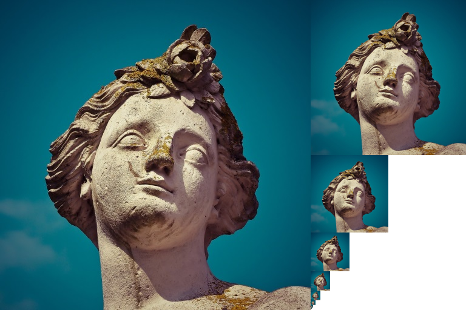

# Mipmap

Vulkan mipmap generation with 3 strategies: blit chain, compute with per-level barriers, compute with subgroup shuffle.



## Usage Guide

> [!TIP]
> This project uses GitHub Action to ensure you can build and properly generate the results, tested in macOS and Ubuntu.
> If you are struggling with the build, please refer to the [workflow file](.github/workflows/deploy-and-test.yml) to see how it works.

It reads the power-of-2 image, generate full mipmaps by their strategies, and persist the result into output directory. You can compare the execution times by their strategies using GPU timestamp query. All core codes are in `main.cpp` and shader codes are in `shaders` directory. Each `subgruop_mipmap_<subgroup-size>.comp` shaders are for subgroup shuffle strategy with their corresponding subgroup size.

### Build

#### Manual build

For compilation, you need:
- C++23 with Standard Library Module (a.k.a. [`import std;`](https://wg21.link/P2465R3))
- CMake ≥ 3.28
- External dependencies:
  - [glslc](https://github.com/google/shaderc/tree/main/glslc): included in Vulkan SDK.
  - [Vulkan Memory Allocator](https://github.com/GPUOpen-LibrariesAndSDKs/VulkanMemoryAllocator) and its [C++ binding](https://github.com/stripe2933/VulkanMemoryAllocator-Hpp) (originally from [Yaaz](https://github.com/YaaZ/VulkanMemoryAllocator-Hpp))
  - [stb_image](https://github.com/nothings/stb/blob/master/stb_image.h)

The compliation only tested in Clang ≥ 17 in [macOS and ubuntu](.github/workflows/deploy-and-test.yml). Custom libc++ have to be built, explained in [here](https://libcxx.llvm.org/Modules.html#using-the-local-build).

```bash
mkdir build
cmake -S . -B build -G Ninja                                          \
  -DCMAKE_BUILD_TYPE=Release                                          \
  -DLIBCXX_BUILD=${{ github.workspace }}/llvm-project/build           \
  -DCMAKE_TOOLCHAIN_FILE=$VCPKG_ROOT/scripts/buildsystems/vcpkg.cmake # Or other package manager what you use
cmake --build build -t mipmap --config Release
```

#### Use prebuilt binary

See the artifacts in the latest workflow. Download `mipmap-<platform>.zip` and extract it. Set proper permissions to the binary (e.g. `chmod +x mipmap`).

### Run

For execution, your Vulkan driver must support:
- Vulkan 1.2
- Following physical device ability:
  - Must support graphics queue.
  - Timestamp query related: `timestampPeriod` > 0 and `timestampComputeAndGraphics`.
  - Subgroup related: subgroup size must be at least 8 and must support subgroup shuffle operation.
- Following device features for the physical device:
  - `hostQueryReset` (`VK_EXT_host_query_reset`)
  - `storageImageUpdateAfterBind` (`VK_EXT_descriptor_indexing`)
  - `runtimeDescriptorArray` (`VK_EXT_descriptor_indexing`)

If all requirements are satisfied, you can run the binary with the following command:

```bash
./mipmap <image-path> <output-dir>
```

The input image must have power of 2 dimensions, and each dimension must be ≥ 32.

In output directory, three files (`blit.png`, `compute_per_level_barriers.png`, `compute_subgroup.png`) will be generated.
Each file corresponds to their generation method, respectively.

## How does it work?

### Blit chain

Already explained in [vulkan-tutorial](https://vulkan-tutorial.com/Generating_Mipmaps). It blits from level `n-1` to `n`
with image layout transition for every level.

`main.cpp:471`
```c++
for (auto [srcLevel, dstLevel] : std::views::iota(0U, image.mipLevels) | std::views::pairwise) {
    if (srcLevel != 0U){
        const std::array barriers {
            vk::ImageMemoryBarrier {
                vk::AccessFlagBits::eTransferWrite, vk::AccessFlagBits::eTransferRead,
                vk::ImageLayout::eTransferDstOptimal, vk::ImageLayout::eTransferSrcOptimal,
                {}, {},
                image,
                { vk::ImageAspectFlagBits::eColor, srcLevel, 1, 0, 1 }
            },
            vk::ImageMemoryBarrier {
                {}, vk::AccessFlagBits::eTransferWrite,
                {}, vk::ImageLayout::eTransferDstOptimal,
                {}, {},
                image,
                { vk::ImageAspectFlagBits::eColor, dstLevel, 1, 0, 1 }
            },
        };
        commandBuffer.pipelineBarrier(
            vk::PipelineStageFlagBits::eTransfer, vk::PipelineStageFlagBits::eTransfer,
            {}, {}, {}, barriers);
    }

    commandBuffer.blitImage(
        image, vk::ImageLayout::eTransferSrcOptimal,
        image, vk::ImageLayout::eTransferDstOptimal,
        vk::ImageBlit {
            { vk::ImageAspectFlagBits::eColor, srcLevel, 0, 1 },
            { vk::Offset3D{}, vk::Offset3D { vku::convertOffset2D(image.mipExtent(srcLevel)), 1 } },
            { vk::ImageAspectFlagBits::eColor, dstLevel, 0, 1 },
            { vk::Offset3D{}, vk::Offset3D { vku::convertOffset2D(image.mipExtent(dstLevel)), 1 } },
        },
        vk::Filter::eLinear);
}
```

However, this method has several disadvantages:
- It requires multiple image layout transitions, which is done by pipeline barriers, stall the pipeline.
- It requires graphics capability (not very much a problem, but could be ridiculous if you deal with compute specialized queue families).

### Compute with per-level barriers

This project uses `16x16` workgroup, and each invocation fetches 4 texels from the source image.

`mipmap.comp:12`
```glsl
void main(){
    vec4 averageColor
        = imageLoad(mipImages[srcLevel], 2 * ivec2(gl_GlobalInvocationID.xy))
        + imageLoad(mipImages[srcLevel], 2 * ivec2(gl_GlobalInvocationID.xy) + ivec2(1, 0))
        + imageLoad(mipImages[srcLevel], 2 * ivec2(gl_GlobalInvocationID.xy) + ivec2(0, 1))
        + imageLoad(mipImages[srcLevel], 2 * ivec2(gl_GlobalInvocationID.xy) + ivec2(1, 1));
    averageColor /= 4.0;
    imageStore(mipImages[dstLevel], ivec2(gl_GlobalInvocationID.xy), averageColor);
}
```

`main.cpp:82`
```c++
commandBuffer.bindPipeline(vk::PipelineBindPoint::eCompute, *pipeline);
commandBuffer.bindDescriptorSets(vk::PipelineBindPoint::eCompute, *pipelineLayout, 0, descriptorSets, {});
for (auto [srcLevel, dstLevel] : std::views::iota(0U, mipLevels) | std::views::pairwise) {
    if (srcLevel != 0U) {
        constexpr vk::MemoryBarrier barrier {
            vk::AccessFlagBits::eShaderWrite, vk::AccessFlagBits::eShaderRead,
        };
        commandBuffer.pipelineBarrier(
            vk::PipelineStageFlagBits::eComputeShader, vk::PipelineStageFlagBits::eComputeShader,
            {}, barrier, {}, {});
    }

    commandBuffer.pushConstants<PushConstant>(*pipelineLayout, vk::ShaderStageFlagBits::eCompute, 0, PushConstant { srcLevel });
    commandBuffer.dispatch(
        divCeil(baseImageExtent.width >> dstLevel, 16U),
        divCeil(baseImageExtent.height >> dstLevel, 16U),
        1);
}
```

This method has some advantages and disadvantages compared to the blit chain:
- It doesn't require image layout transition between dispatch (pros), but still requires memory barrier (cons).
- Must manage the pipeline and descriptors (cons).
- Slower than blit chain, because it must compile the shader and bind the pipeline and descriptors (cons).
- Cannot be used for non-power of 2 dimension images (cons).

### Compute with subgroup shuffle

This is the most important process, so I'll explain it in detail.

#### Mapping from invocation ID to texel fetch position

In shader, **invocations within a specific group can communicate without an explicit synchronization**, which is called ***subgroup***. Size of subgroups are differ in system, but every NVIDIA GPUs are 32 and typical AMD GPUs are 64.

Let's assume that the workgroup size is `16x16`. Then, total `256 / 32 = 8` subgroups are laid linearly in the workgroup.


In the above figure, each `16x2` subgroup is filled with alternating background color for distinction. Numbers in each cell are `gl_SubgroupInvocationID`.
Although they can communicate inside the subgroup, currently each subgroup location is not mapped into the proper texel fetch location. For example, in the first subgroup in the above figure (filled with light blue), ID with 0, 1, 16 and 17 can communicate and make `2x2` region into 1 average pixel, however it can't make `4x4` region into 1 because the row count of a subgroup is 2. Therefore, for maximize the subgroup communication, we **should make the subgroup extent as square as possible**.


In common with the previous figure, each subgroup is filled with alternating background color for distinction. In this case, subgroup extent is `8x4`, that is more square-shaped than before. Now, each subgroup can make `4x4` region (`0..3, 8..11, 16..19, 24..27`) into 1 average pixel.

Of course the physical subgroup layout is still the former one, so we need a mapping between texel fetch location and `gl_LocalInvocationID`. In this case, I use

```glslc
ivec2 sampleLocation = gl_WorkGroupSize.xy * gl_WorkGroupID.xy + ivec2(
    gl_LocalInvocationID.x % 8 + (gl_LocalInvocationID.y / 8) * 8,
    ((gl_LocalInvocationID.y / 2) * 2 + gl_LocalInvocationID.x / 8) % 16
);
```

Or more bit manipulation friendly version:

```glslc
ivec2 samplePosition = gl_WorkgroupSize.xy * gl_WorkGroupID.xy + ivec2(
    (gl_LocalInvocationID.x & 7U) | (gl_LocalInvocationID.y & ~7U),
    ((gl_LocalInvocationID.y << 1U) | (gl_LocalInvocationID.x >> 3U)) & 15U
);
```

With this mapping, our invocations' fetching position will be:


With aligned cell by their sampling position, now the subgroups have the proper sample position.


#### Subgroup shuffle

With properly mapped texels in the subgroup, we can use ***Subgroup shuffle*** to average the invocation quads.


Above figure is visualization of `gl_SubgroupInvocationID` with binary form in a subgroup. With [`subgroupShuffleXor`](https://www.khronos.org/blog/vulkan-subgroup-tutorial), an invocation (let's say its `gl_SubgroupInvocationID` as `i`) can access to the invocation's data, whose `gl_SubgroupInvocationID` is `i ^ <constant-value>`, i.e. bitwise XOR.

For example, the following shader invoked in the invocations whose `gl_SubgroupID`s are `0, 1, 8, 9` will be:

```glsl
vec4 averageColor = imageLoad(baseImage, samplePosition);

// | gl_SubgroupInvocationID |  gl_LocalInvocationID.xy  |   averageColor    |
// |-------------------------|---------------------------|-------------------|
// |       0(=0b00000)       |           (0, 0)          |  baseImage[0, 0]  |---┐
// |-------------------------|---------------------------|-------------------|   |
// |       1(=0b00001)       |           (1, 0)          |  baseImage[1, 0]  |---|--┐
// |-------------------------|---------------------------|-------------------|   |  |
// |       8(=0b01000)       |           (0, 1)          |  baseImage[0, 1]  |---|--|--┐
// |-------------------------|---------------------------|-------------------|   |  |  |
// |       9(=0b01001)       |           (1, 1)          |  baseImage[1, 1]  |---|--|--|--┐
                                                                            //   |  |  |  |
averageColor += subgroupShuffleXor(averageColor, 1);                        //   |  |  |  |
                                                                            //   |  |  |  |
// | gl_SubgroupInvocationID | gl_SubgroupInvocationID^1 |   averageColor    |   |  |  |  |
// |-------------------------|---------------------------|-------------------|   |  |  |  |
// |       0(=0b00000)       |         1(=0b00001)       | baseImage[0, 0]   |   |  |  |  |
// |                         |                           | + baseImage[1, 0] |<--|--┘--|--|--┐
// |-------------------------|---------------------------|-------------------|   |     |  |  |
// |       1(=0b00001)       |         0(=0b00000)       | baseImage[1, 0]   |   |     |  |  |
// |                         |                           | + baseImage[0, 0] |<--┘-----|--|--|--┐
// |-------------------------|---------------------------|-------------------|         |  |  |  |
// |       8(=0b01000)       |         9(=0b01001)       | baseImage[0, 1]   |         |  |  |  |
// |                         |                           | + baseImage[1, 1] |<--------|--┘--|--|--┐
// |-------------------------|---------------------------|-------------------|         |     |  |  |
// |       9(=0b01001)       |         8(=0b01000)       | baseImage[1, 1]   |         |     |  |  |
// |                         |                           | + baseImage[0, 1] |<--------┘-----|--|--|--┐
                                                                            //               |  |  |  |
averageColor += subgroupShuffleXor(averageColor, 8);                        //               |  |  |  |
                                                                            //               |  |  |  |
// | gl_SubgroupInvocationID | gl_SubgroupInvocationID^8 |   averageColor    |               |  |  |  |
// |-------------------------|---------------------------|-------------------|               |  |  |  |
// |       0(=0b00000)       |         8(=0b01000)       | baseImage[0, 0]   |               |  |  |  |
// |                         |                           | + baseImage[1, 0] |               |  |  |  |
// |                         |                           | + baseImage[0, 1] |<--------------|--|--┘  |
// |                         |                           | + baseImage[1, 1] |               |  |     |
// |-------------------------|---------------------------|-------------------|               |  |     |
// |       1(=0b00001)       |         9(=0b01001)       | baseImage[1, 0]   |               |  |     |
// |                         |                           | + baseImage[1, 1] |               |  |     |
// |                         |                           | + baseImage[0, 0] |<--------------|--|-----┘
// |                         |                           | + baseImage[0, 1] |               |  |
// |-------------------------|---------------------------|-------------------|               |  |
// |       8(=0b01000)       |         0(=0b00000)       | baseImage[0, 1]   |               |  |
// |                         |                           | + baseImage[1, 1] |               |  |
// |                         |                           | + baseImage[0, 0] |<--------------┘  |
// |                         |                           | + baseImage[1, 0] |                  |
// |-------------------------|---------------------------|-------------------|                  |
// |       9(=0b01001)       |         1(=0b00001)       | baseImage[1, 1]   |                  |
// |                         |                           | + baseImage[0, 1] |                  |
// |                         |                           | + baseImage[1, 0] |<-----------------┘
// |                         |                           | + baseImage[0, 0] |

averageColor /= 4.0;
```

Therefore, `averageColor += subgroupShuffleXor(averageColor, 1)` means it sums the horizontally adjacent `averageColor`, and `averageColor += subgroupShuffleXor(averageColor, 8)` means it sums the vertically adjacent `averageColor`.

After the averaging, the next `subgroupShuffleXor` would be:

```glsl
averageColor += subgroupShuffleXor(averageColor, 2);
averageColor += subgroupShuffleXor(averageColor, 16);
averageColor /= 4.0;
```

Because all adjacent quad have same `averageColor` in the previous phase, it must communicate with the next 2-stride adjacent quad.

### Shared memory with barrier

If your system's subgroup size is 32, it can shape `8x4` subgroup extent, therefore two `4x4` region can be mipmapped into 1 pixel. Even if you're using AMD GPU and have 64 subgroup size, it can shape `8x8` subgroup extent and `8x8` regino can be mipmapped. This is still far from our goal, `32x32` region into 1 pixel. To achieve this, we need to use shared memory.

Each subgroup will store their `averageColor` in shared memory, and after explicit synchronization (`memoryBarrierShared(); barrier();`), the representing invocation in each `2^n x 2^n` region will be averaging up the shared `averageColor`. For subgroup size 32, this must be executed in twice.

`subgroup_mipmap_32.comp:54`
```glsl
averageColor += subgroupShuffleXor(averageColor, 4U /* 0b00100 */);
if (subgroupElect()){
    sharedData[gl_SubgroupID] = averageColor;
}

memoryBarrierShared();
barrier();

if ((gl_SubgroupID & 1U) == 1U){
    averageColor = (sharedData[gl_SubgroupID] + sharedData[gl_SubgroupID ^ 1U]) / 4.f;
    imageStore(mipImages[pc.baseLevel + 4U], sampleCoordinate >> 3, averageColor);
}

if (gl_LocalInvocationIndex == 0U){
    averageColor = (sharedData[0] + sharedData[1] + sharedData[2] + sharedData[3] + sharedData[4] + sharedData[5] + sharedData[6] + sharedData[7]) / 16.f;
    imageStore(mipImages[pc.baseLevel + 5U], sampleCoordinate >> 4, averageColor);
}
```

As bigger subgroup size, the synchronization barrier executed less, so the performance will be better.

#### How this can be fast?

This can be faster than the previous compute-based strategy, because it has significantly less memory barrier (10 vs 1 for `1024x1024` image). Each `32x32` region can be mipmapped by just 1 dispatch. For every dispatch, shaders load the texel from image (which is stored in VRAM), and store them into image repeatedly. With subgroup operation, each level except the first `imageLoad` phase, `averageColor` can be loaded in L2 cache, which is far faster than loading from VRAM.

#### What is the downside of this method?

Although it is faster than the previous compute-based strategy, it may still slower than blit-chain method if you're using non compute-specialized queue, or just mipmapping a single image. It shares the same downside of the previous one (have to manage pipeline and descriptor sets, can be only used in power of 2 images) and has additional constraint: image size must be at least `32x32` and your last dispatch input image size must be `32x32`. For example, if you're mipmapping `256x256` image, dispatching would be:

1. `PushConstant { .baseLevel = 0, .remainingMipLevels = 3 }`: `256x256` -> `32x32`
2. `PushConstant { .baseLevel = 3, .remainingMipLevels = 5 }`: `32x32` -> `1x1`

In `SubgroupMipmapComputer::compute` method, the way to managing this step is explained in the code.

---

## License

This project is licensed under the MIT License - see the [LICENSE](LICENSE.txt) file for details.
```